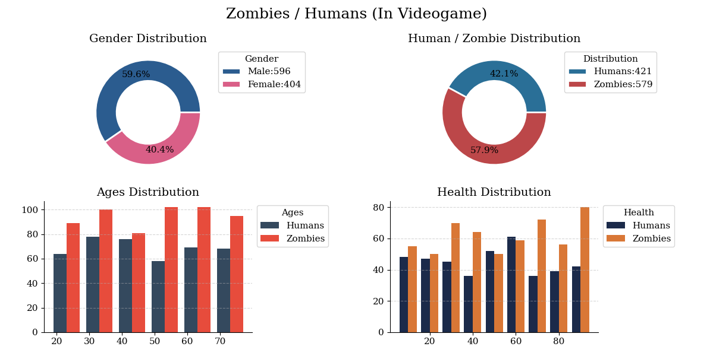

# 🧟‍♂️ Zombie vs. Human Population Data Visualization

A Python data visualization project built with NumPy, Pandas, and Matplotlib. This script generates a synthetic dataset representing a video game population of humans and zombies, analyzing key demographic traits—such as gender balance, species proportion, age distribution, and health status—through a sleek, multi-panel dashboard.

---

## 📊 Dashboard Features

* **Gender Distribution:** Doughnut chart highlighting the overall ratio of male and female entities across the dataset.
* **Species Breakdown:** Doughnut chart comparing the percentage split between Humans and Zombies (configured at a ~40/60 base probability).
* **Age Demographics:** Multi-bar histogram illustrating the age distribution across species within the 18–80 age range.
* **Health Distribution:** Multi-bar histogram visualizing the health point (HP) ranges across species (5–100 HP).

---

## 🎨 Design & Styling Details

* **Base Style:** Built on Matplotlib's `fivethirtyeight` preset with global serif typography.
* **Custom Color Palettes:** Carefully chosen hex colors for visual separation and readability:
  * **Gender:** `#2B5C8F` (Deep Slate Blue) & `#D95F87` (Muted Rose)
  * **Species Ratio:** `#2A6F97` (Steel Blue) & `#BC4749` (Crimson)
  * **Age Comparison:** `#34495e` (Dark Slate) & `#E74C3C` (Soft Red)
  * **Health Comparison:** `#1B2A4A` (Navy Blue) & `#D97736` (Warm Copper)
* **Layout Polish:** Donut charts built with crisp white borders, subplots cleaned of top/right spines, dashed y-axis grids, and externalized legends to keep data areas uncluttered.

---

## 📦 Dataset Configuration

The synthetic dataset generates N = 1000 entities using a fixed random seed (`seed = 42`) for full reproducibility:

| Feature | Type | Range / Options | Distribution |
| :--- | :--- | :--- | :--- |
| **type** | Categorical | Human, Zombie | 40% Human / 60% Zombie |
| **age** | Integer | 18 – 80 | Uniform Random |
| **sex** | Categorical | Male, Female | 60% Male / 40% Female |
| **health** | Integer | 5 – 100 | Uniform Random |

---

## 🚀 Getting Started

### Prerequisites

Make sure you have Python installed along with the required dependencies:

pip install numpy pandas matplotlib

## 📄 License

This project is open-source and available under the MIT License.