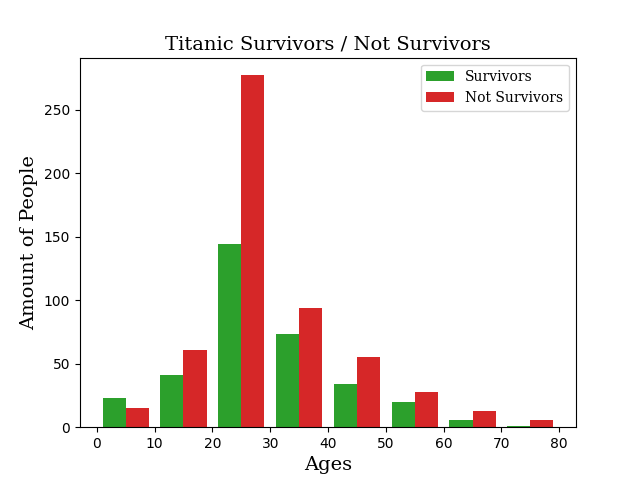

# Titanic Survival Analysis by Age Group

A data analysis project exploring the correlation between passenger age and survival rates using the classic Kaggle Titanic dataset. This script demonstrates data cleaning, missing value imputation, age group segmentation, and data visualization with Python.

---

## Overview

The goal of this analysis is to evaluate how age impacted a passenger's likelihood of survival aboard the Titanic. By cleaning raw demographic data and bucketing age ranges into 10-year intervals, this project highlights key survival metrics across different age demographics.

---

## Dataset

* **Source:** [Kaggle - Titanic: Machine Learning from Disaster](https://www.kaggle.com/c/titanic/data)
* **File Used:** `train.csv`
* **Key Features:** `Survived` (0 = No, 1 = Yes), `Age` (Passenger age in years)

---

## Key Features & Workflow

1. **Data Preprocessing & Cleaning:**
   * Removed non-essential columns (`PassengerId`, `Pclass`, `Name`, `Cabin`, `Ticket`, etc.) to streamline analysis.
   * Handled missing age values by imputing the dataset's overall median age.
   * Converted age floating points to integers and adjusted extreme outlier values.

2. **Data Visualization:**
   * Built a side-by-side comparative histogram using `matplotlib` to visualize age distribution across survivors and non-survivors in 10-year bins.

3. **Demographic Breakdown:**
   * Filtered and quantified survival counts across key adult age brackets (20–30, 30–40, and 40–50 years old).

---

## Visualizations

### Age Distribution vs. Survival Status
The histogram illustrates passenger outcomes broken down into 10-year age increments:



---

## Getting Started

### Prerequisites

Ensure you have Python installed along with the required libraries:

```bash
pip install pandas numpy matplotlib 