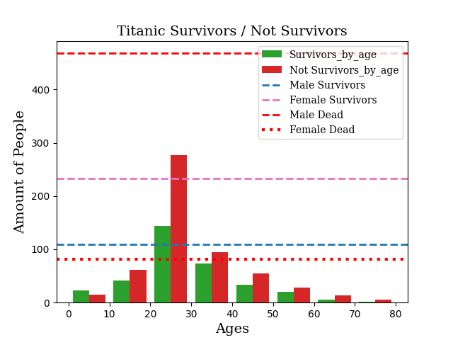

# 🚢 Titanic Survival Analysis

An exploratory data analysis (EDA) and data visualization project analyzing passenger survival rates from the Titanic dataset using Python (**Pandas**, **NumPy**, and **Matplotlib**).

---

## 📌 Project Overview

This script cleans Kaggle's classic Titanic training dataset, filters key features (age, sex, and survival status), and delivers:
1. **Comparative Histograms** showcasing the age distribution between survivors and non-survivors.
2. **Horizontal Reference Lines** tracking how gender impacted overall survival.
3. **Quantitative Breakdowns** printed to the console for specific age brackets (20 to 50 years old).

---

## 🛠️ Requirements & Installation

Make sure you have Python 3.x installed along with the required libraries:

```bash
pip install numpy pandas matplotlib
```

Download the training dataset from Kaggle and place it in the following directory:
`kaggle/titanic/train.csv`

---

## 🚀 Running the Script

Execute the main script via terminal:

```bash
python main.py
```

---

## 🧹 Data Preprocessing

The `cleaning_data` function handles key data transformations:
* **Feature Dropping:** Removes non-essential variables (`PassengerId`, `Pclass`, `Name`, `SibSp`, `Parch`, `Ticket`, `Fare`, `Cabin`, `Embarked`).
* **Imputation:** Fills missing values in the `Age` column using the **median**.
* **Age Standardization:** Casts age values to integers and overrides records under 3 years old with the calculated median.

---

## 📊 Visualizations




The generated plot integrates two visual layers:
* **Age Histogram (Green vs. Red):** Bins age groups in 10-year intervals (0 to 80) to contrast survivors against non-survivors.
* **Gender Threshold Lines:**
  * **Dashed Blue (`--`):** Surviving Males
  * **Dashed Pink (`--`):** Surviving Females
  * **Dashed Red (`--`):** Deceased Males
  * **Dotted Red (`:`):** Deceased Females

---

## 📈 Key Insights & Analysis

Based on the processed metrics and plot output:

### 1. Stark Gender Disparity ("Women and Children First")
* **Female Survival Advantage:** The horizontal line for female survivors sits significantly higher than that of male survivors.
* **Male Mortality Rate:** Deceased males account for the highest count across the board, confirming that gender was the single most decisive factor during evacuation.

### 2. Age Bracket Breakdown (20 to 50 Years Old)
Console output for adult demographics highlights:
* **20–30 Age Group:** Represents the largest overall demographic onboard. It accounts for the highest absolute numbers in both casualties and survivors, showing that young adults bore a massive portion of total losses.
* **30–40 Age Group:** Displays a slightly narrower gap between survivors and casualties compared to the 20–30 bracket, though non-survivors still outnumber survivors.
* **40–50 Age Group:** Features a smaller overall sample size, with survival counts declining further as age increases.

### 3. Preprocessing Impact
* Imputing missing age values with the **median** (~28 years old) artificially inflates the **20–30 age bin**. Keep this imputation bias in mind when evaluating exact frequencies in that specific bracket.